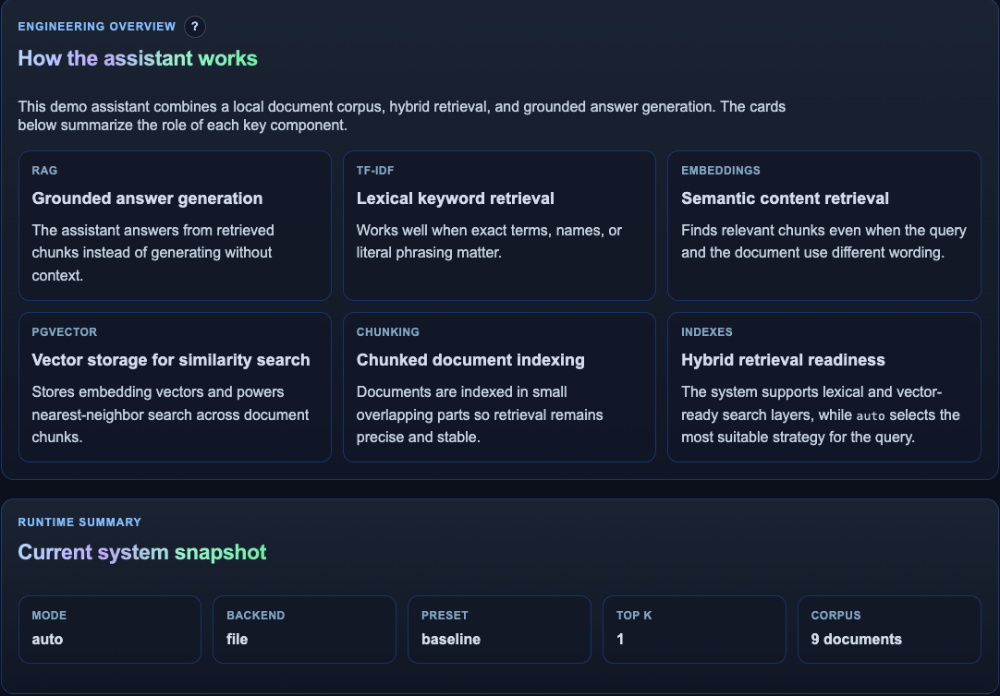
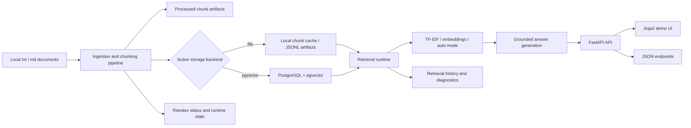
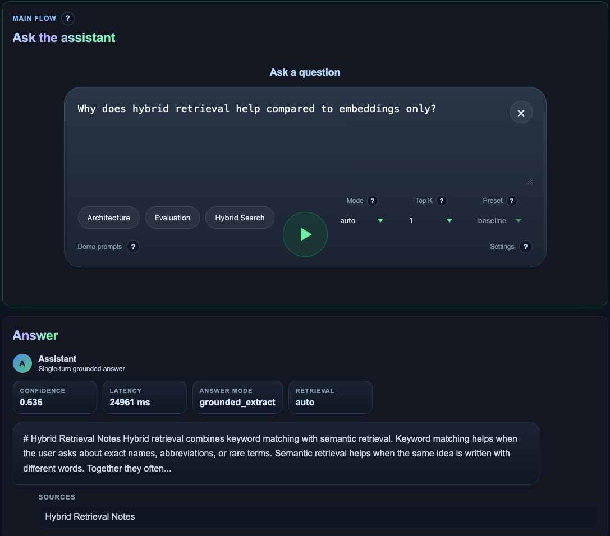
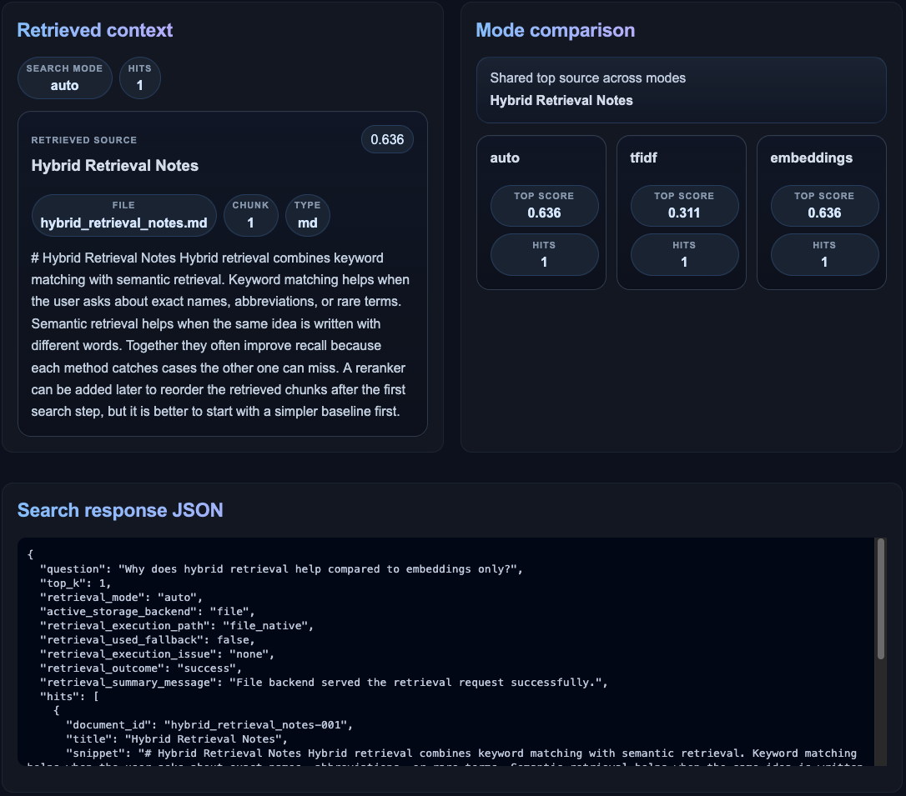
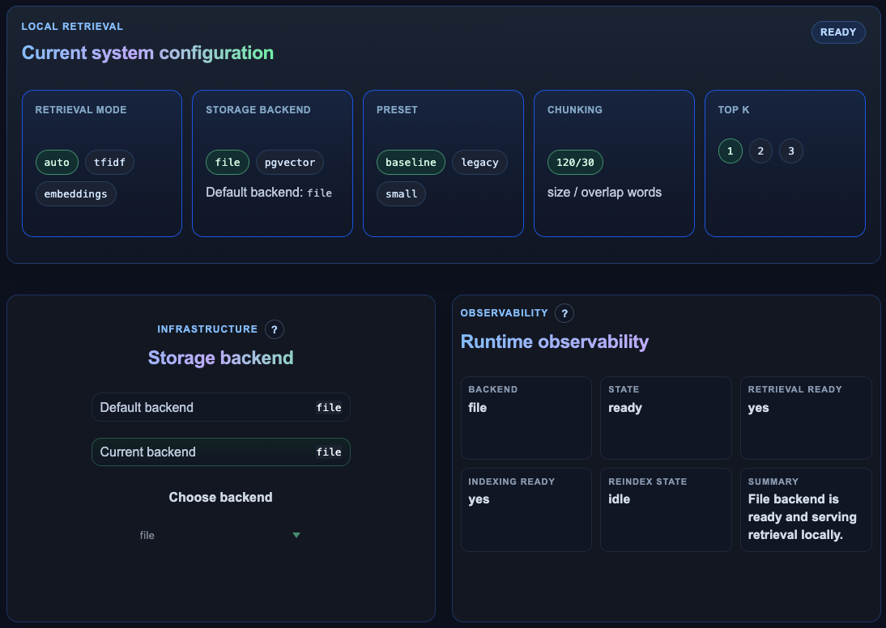
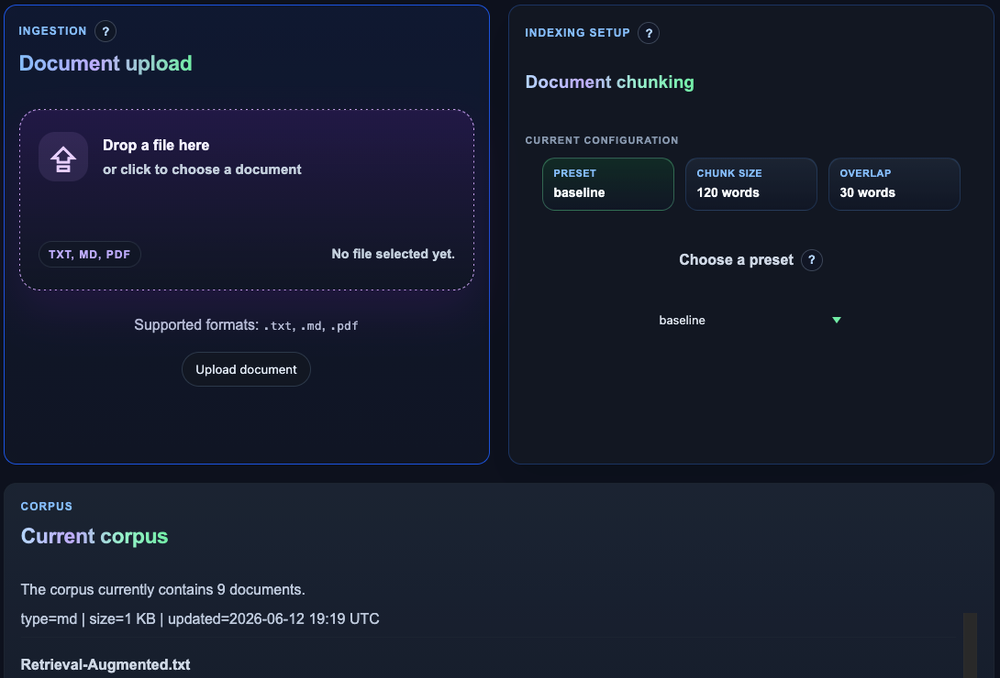
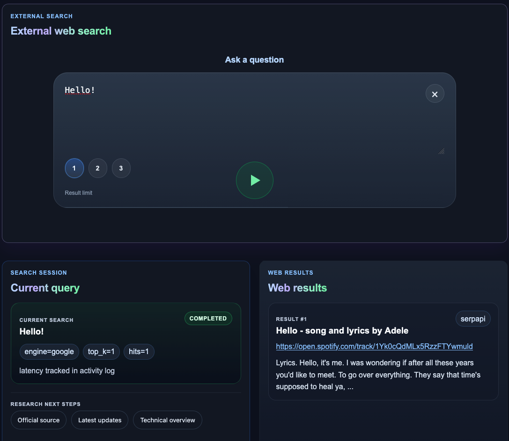
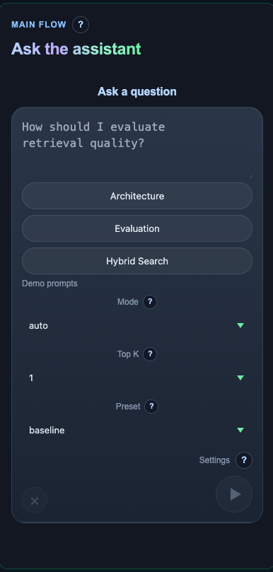

# AI Knowledge Assistant

Portfolio-ready `RAG` project with local document ingestion, configurable retrieval, grounded answering, evaluation scripts, and a lightweight demo UI.

<p align="center">
  
  
  
  
  
  
  
  
</p>

<p align="center">
  <a href="https://assistant.fsprojects.pp.ua/">Live Demo</a>
  ·
  <a href="#screenshots">Screenshots</a>
  ·
  <a href="#architecture">Architecture</a>
  ·
  <a href="#docker-compose-run">Docker Compose</a>
</p>

<p align="center">
  
</p>

## Why This Project Matters

This project is designed as a compact but engineering-focused `RAG` system rather than a simple chat demo. It shows how local ingestion, configurable retrieval, grounded answering, runtime visibility, and operator-friendly UI can work together as one coherent product surface.

- configurable `RAG` pipeline with ingestion, chunking, retrieval mode switching, and grounded answers backed by explicit evidence
- observability-oriented runtime with reindex lifecycle, retrieval history, diagnostics, and transparent system status
- `PostgreSQL + pgvector` support and a production-like delivery surface through `FastAPI`, `Jinja2`, API endpoints, and Docker Compose

## Engineering Focus

- retrieval architecture with `file`, `TF-IDF`, embeddings, and `pgvector` paths for realistic experimentation rather than a single hardcoded flow
- transparent runtime surface that exposes sources, retrieval decisions, reindex state, and diagnostics instead of hiding system behavior behind a minimal chat UI
- production-minded delivery through API-first design, operator-visible status pages, protected admin actions, and containerized local deployment

## Quick Links

- [Why This Project Matters](#why-this-project-matters)
- [Engineering Focus](#engineering-focus)
- [Screenshots](#screenshots)
- [What It Does](#what-it-does)
- [Architecture](#architecture)
- [System Design Decisions](#system-design-decisions)
- [Operational Capabilities](#operational-capabilities)
- [Evaluation And Quality Signals](#evaluation-and-quality-signals)
- [Tech Stack](#tech-stack)
- [Key Features](#key-features)
- [What I Implemented Myself](#what-i-implemented-myself)
- [Project Structure](#project-structure)
- [API Surface](#api-surface)
- [Endpoints](#endpoints)
- [Live Demo](#live-demo)
- [Deployment Notes](#deployment-notes)
- [Local Run](#local-run)
- [Docker Compose Run](#docker-compose-run)
- [Optional LLM Mode](#optional-llm-mode)
- [Optional Web Search AI](#optional-web-search-ai)

## What It Does

This project implements an end-to-end knowledge assistant workflow:

- loads local `txt` and `md` documents;
- splits them into chunks and stores processed artifacts;
- retrieves relevant chunks with `TF-IDF` or embeddings;
- generates grounded answers from retrieved context;
- exposes retrieval controls through API and UI;
- evaluates retrieval quality and stores experiment reports.

## Architecture



This repository is organized as a compact production-like `RAG` system with four main layers:

1. `Ingestion`  
   Local `txt` and `md` files are parsed, cleaned, and split into configurable chunks.

2. `Storage and indexing`  
   Chunks can be served from the default `file` backend or persisted into `PostgreSQL + pgvector` for database-first retrieval experiments.

3. `Retrieval and answer generation`  
   The runtime supports `TF-IDF`, embeddings, and automatic retrieval mode selection, then builds grounded answers from the selected evidence.

4. `Delivery and observability`  
   The system exposes both a portfolio UI and API endpoints, while also tracking reindex status, runtime state, retrieval history, and evaluation outputs.

Runtime view:

```text
Raw documents
  -> chunking pipeline
    -> file backend or pgvector backend
      -> retrieval runtime
        -> grounded answer / search results
          -> FastAPI API and demo UI
```

## System Design Decisions

- `file` and `pgvector` both exist to keep the system useful in two modes: a low-friction local baseline for fast iteration and a database-backed retrieval path for realistic indexing, filtering, and retrieval experiments.
- external search stays separate from local corpus retrieval so the project can demonstrate a clear boundary between trusted internal knowledge and optional web-sourced context.
- retrieval history and reindex lifecycle are persisted because retrieval quality is easier to improve when the system exposes what was indexed, when it changed, and how each query was resolved.
- the UI is intentionally transparent and debug-friendly so the same interface works as both a demo surface and an operator surface for inspecting sources, retrieval choices, runtime state, and diagnostics.

## Operational Capabilities

- health checks for application and database readiness support predictable startup and easier deployment debugging
- `Docker Compose` packages the app, `PostgreSQL + pgvector`, `Redis`, and worker processes into one reproducible local stack
- background worker support allows longer-running indexing and maintenance flows to move outside the request-response path
- protected admin actions separate public demo access from operational controls such as document management and system actions
- runtime status surfaces expose reindex state, retrieval history, lifecycle metadata, and system visibility directly in the UI

## Evaluation And Quality Signals

- retrieval metrics and evaluation scripts make relevance quality measurable instead of relying only on subjective answer quality
- saved reports preserve experiment outputs so retrieval changes can be reviewed over time rather than judged from a single run
- experiment comparison supports side-by-side inspection of retrieval and chunking outcomes across multiple report snapshots
- chunking evaluation keeps ingestion decisions explicit by showing how chunk size and overlap affect downstream retrieval behavior

## Tech Stack

- `Python`
- `FastAPI`
- `Pydantic`
- `Jinja2` templates
- vanilla `JavaScript` and `CSS`
- `scikit-learn` for `TF-IDF`
- `sentence-transformers` for embeddings baseline

## Key Features

- local ingestion pipeline for `txt` and `md` documents
- processed chunk storage in `data/processed/chunks.jsonl`
- retrieval modes: `auto`, `tfidf`, `embeddings`
- grounded answer generation with safe fallback behavior
- optional OpenAI-compatible LLM integration
- separate `Web Search AI` flow with OpenAI-compatible search and `SerpAPI` fallback
- evaluation dataset, metrics, report history, and report comparison
- demo UI with retrieval mode switch, chunking preset switch, document upload, and mode comparison

## What I Implemented Myself

- local document ingestion and processed chunk pipeline
- retrieval baseline evolution from simple search to `TF-IDF` and embeddings
- grounded answer flow with confidence and fallback behavior
- evaluation scripts for metrics, chunking experiments, and saved report comparison
- API controls for retrieval mode and chunking presets
- server-rendered demo UI for asking questions, uploading documents, and comparing modes

## Project Structure

- `api/` - backend app, schemas, retrieval, generation, ingestion
- `data/` - raw corpus, processed chunks, eval dataset, saved reports
- `scripts/` - evaluation and experiment helper scripts
- `templates/` - HTML UI
- `static/` - CSS and JavaScript
- `src/` - reserved for future pipeline modules

## API Surface

The UI and JSON endpoints use the same retrieval and runtime contract, so the browser demo and API surface expose the same chunking, retrieval, answer-generation, and observability behavior.

## Endpoints

- `GET /`
- `GET /health`
- `POST /ingest`
- `POST /search`
- `POST /ask`
- `POST /web-search`
- `GET /chunking-config`
- `POST /chunking-config`

## Live Demo

- Public demo: [https://assistant.fsprojects.pp.ua/](https://assistant.fsprojects.pp.ua/)

## Deployment Notes

- the public demo is intended to sit behind a reverse proxy, while the application itself stays env-driven and container-friendly
- runtime behavior is configured through environment variables so retrieval, storage, LLM, and external search settings can change without code edits
- admin access and protected operational actions are gated separately from the public demo surface through credentials and session controls

## Screenshots

### Main Experience

<p align="center">
  
  
</p>

<p align="center">
  <em>Grounded answer flow, evidence transparency, and retrieval-side explainability.</em>
</p>

### Runtime And Operations

<p align="center">
  
  
</p>

<p align="center">
  <em>Operational surface for runtime health, indexing lifecycle, and document management.</em>
</p>

### Web Search AI Workspace

<p align="center">
  
</p>

<p align="center">
  <em>Dedicated Web Search AI workspace with activity log and debug-friendly output.</em>
</p>

### Mobile Preview

<p align="center">
  
</p>

<p align="center">
  <em>Responsive mobile layout for the main ask flow.</em>
</p>

## Local Run

```bash
python3 -m venv .venv
source .venv/bin/activate
pip install -r requirements.txt
uvicorn api.app:app --reload
```

## Optional Environment Setup

```bash
cp .env.example .env
set -a
source .env
set +a
```

If optional services are not configured, the app keeps working with the local baseline.

For protected admin actions in the UI, also set:

```bash
ADMIN_USERNAME=owner
ADMIN_PASSWORD=change_me_admin_password
ADMIN_SESSION_SECRET=change_me_session_secret
```

Without `ADMIN_PASSWORD`, the assistant stays public, but `Documents` and `System` remain read-only preview areas and protected actions stay disabled.

## Docker Compose Run

This repository includes a Docker Compose setup for the `FastAPI` app, `PostgreSQL + pgvector`, `Redis`, and a background worker.

Files:

- `Dockerfile`
- `docker-compose.yml`
- `.env`
- `docker/app/entrypoint.sh`
- `docker/postgres/init/01-init.sql`

Prepare the environment file:

```bash
cp .env.example .env
set -a
source .env
set +a
```

Build and start the stack:

```bash
docker compose up --build -d
```

Check services:

```bash
docker compose ps
```

Inspect logs:

```bash
docker compose logs -f app
docker compose logs -f db
docker compose logs -f worker
```

Open the app:

```text
http://localhost:8000
```

Stop the stack:

```bash
docker compose down
```

Notes:

- `db` uses a `pgvector`-enabled Postgres image and initializes `EXTENSION vector`;
- `app` and `worker` are built from the local `Dockerfile`;
- `redis` is used for background jobs when Celery is enabled;
- the app exposes port `8000` internally and can be attached to an external proxy network through `proxy_net`;
- Docker daemon must be running before `docker compose up --build`.

Minimal `.env` values for the compose setup:

```bash
POSTGRES_DB=ai_knowledge_assistant
POSTGRES_USER=postgres
POSTGRES_PASSWORD=change-me-postgres-password
CELERY_ENABLED=true
LLM_ENABLED=true
SERPAPI_ENABLED=false
```

## Optional LLM Mode

The project supports OpenAI-compatible grounded answer generation through environment variables.

If LLM settings are missing or a request fails, the app falls back to the local grounded extractive answer.

## Optional Web Search AI

Use `Web Search AI` as a separate external retrieval flow. When configured, it prefers an OpenAI-compatible web-search route and falls back to `SerpAPI`:

```bash
SERPAPI_ENABLED=true
SERPAPI_API_KEY=your_serpapi_key
SERPAPI_ENGINE=google
SERPAPI_NUM_RESULTS=5
SERPAPI_TIMEOUT_SEC=15
```

This integration is intentionally separate from local retrieval and can be demonstrated through `POST /web-search` and the `Web Search AI` UI workspace.
